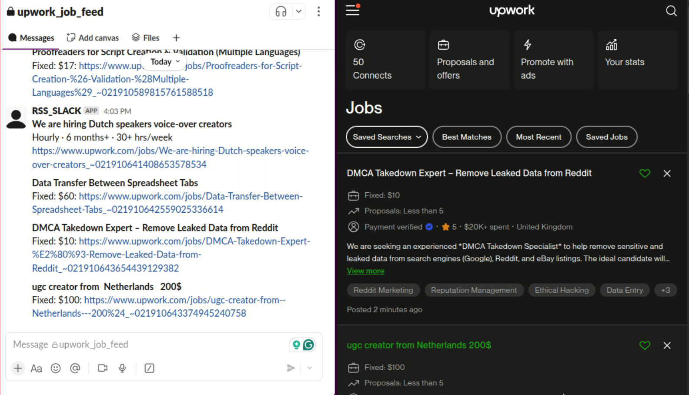

# Upwork Job Feed to Slack Integration without RSS

## Overview
The Upwork Job Feed to Slack Notifier is a Python-based automation tool designed to streamline the process of monitoring job postings on Upwork. By leveraging web scraping techniques, the tool fetches job listings from Upwork without relying on RSS feeds, filters them based on specific criteria, and sends real-time notifications to a designated Slack channel. This eliminates the need for manual monitoring and constant refreshing of the Upwork platform.

The tool uses Selenium with `undetected-chromedriver` to scrape job details in a headless browser environment, ensuring compatibility with Upwork's dynamic web pages while minimizing detection by CAPTCHA scanners. It supports both local execution and deployment on a Virtual Private Server (VPS) such as a DigitalOcean Droplet.

## Demo Video

Click the thumbnail below to open the demo video in a new tab: 

<div style="display: flex; justify-content: center;">
  <a href="Upwork_job_feeder_demo.mp4" target="_blank">
    
  </a>
</div>

(if you are unable to view, click 'View raw' to download it: [[Upwork_job_feeder_demo.mp4](https://github.com/bonsai89/binance_trading_bot_futures/blob/main/binance_bot_trades_demo.mp4)])


## Features
- **Automated Job Scraping**: Periodically fetches job postings from Upwork's job feed without requiring RSS.
- **Custom Filtering**: Extracts key job details, including title, type (e.g., hourly or fixed-price), budget, and URL.
- **Slack Integration**: Sends formatted notifications to a specified Slack channel for new job postings.
- **Persistent Tracking**: Maintains a record of sent job entries to prevent duplicate notifications.
- **Headless Execution**: Runs in a headless Chrome browser to reduce resource usage and enable server-side deployment.
- **CAPTCHA Evasion**: Utilizes `undetected-chromedriver` to minimize detection by Upwork's anti-bot mechanisms.
- **Session Persistence**: Saves browser cookies to enable automatic logins after an initial manual login.

## Project Structure
The project consists of two primary scripts:
1. **`manual_login_session.py`**: Facilitates manual login to Upwork to save session cookies for future automated logins.
2. **`selenium_version.py`**: The main script that scrapes job postings, filters them, and sends notifications to Slack.
3. **`selenium_version_server.py`**: A variant of `selenium_version.py` optimized for deployment on a VPS (e.g., DigitalOcean Droplet).

## Prerequisites
To run this project, ensure the following dependencies are installed:
- **Python 3.8+**
- **Google Chrome** (for local execution)
- **Dependencies**:
  ```bash
  pip install undetected-chromedriver selenium beautifulsoup4 slack-sdk
  ```
- **Slack API Token**: Obtain a bot token from your Slack workspace with permissions to post messages to a channel.
- **Upwork Account**: A valid Upwork account with credentials for login.
- **Chrome Profile**: A dedicated Chrome profile for session persistence (recommended).

For VPS deployment, additional setup may be required:
- A Linux-based VPS (e.g., Ubuntu 20.04+).
- Chrome and ChromeDriver installed on the server.
- Xvfb (for headless display on servers without a GUI).

## Installation
1. **Clone the Repository**:
   ```bash
   git clone https://github.com/your-repo/upwork-job-feed-slack.git
   cd upwork-job-feed-slack
   ```

2. **Install Dependencies**:
   ```bash
   pip install -r requirements.txt
   ```
   Create a `requirements.txt` with:
   ```
   undetected-chromedriver
   selenium
   beautifulsoup4
   slack-sdk
   ```

3. **Set Up Slack Integration**:
   - Create a Slack app in your workspace and obtain a bot token (`xoxb-...`).
   - Invite the bot to the desired Slack channel.
   - Update the `slack_token` variable in `selenium_version.py` or `selenium_version_server.py` with your token.

4. **Configure Chrome Profile**:
   - Identify the path to your Chrome user data directory (e.g., `~/.config/google-chrome/`).
   - Specify the profile directory (e.g., `Profile 2`) in both scripts.

## Usage
### Step 1: Manual Login
Run `manual_login_session.py` to authenticate with Upwork and save session cookies:
```bash
python manual_login_session.py
```
- A Chrome browser window will open, prompting you to log in to Upwork manually.
- After logging in, wait for approximately 120 seconds for the script to save cookies to `upwork_cookies.pkl`.
- The script will confirm successful cookie storage and close the browser.

### Step 2: Run the Scraper
Execute `selenium_version.py` to start monitoring job postings:
```bash
python selenium_version.py
```
- The script runs in headless mode, periodically scraping Upwork's job feed.
- New job postings are sent to the configured Slack channel with details (title, job type, budget, and URL).
- The script tracks sent jobs in `sent_entries.txt` to avoid duplicates.
- The browser scrolls through the job feed to load dynamic content, with a 60-second interval between checks.

### Step 3: Deploy on a VPS (Optional)
For continuous operation, use `selenium_version_server.py` on a VPS:
1. **Set Up the VPS**:
   - Install Python, Chrome, and ChromeDriver.
   - Install Xvfb for headless execution:
     ```bash
     sudo apt update
     sudo apt install -y xvfb
     ```
   - Start Xvfb:
     ```bash
     Xvfb :99 -ac &
     export DISPLAY=:99
     ```

2. **Transfer Files**:
   - Copy the project files and `upwork_cookies.pkl` to the VPS.

3. **Run the Script**:
   ```bash
   python selenium_version_server.py
   ```
   - Ensure the Chrome profile path and Slack token are correctly configured.
   - The script operates similarly to `selenium_version.py` but is optimized for server environments.

## Configuration
Edit the following variables in `selenium_version.py` or `selenium_version_server.py`:
- `slack_token`: Your Slack bot token.
- `slack_channel`: The target Slack channel (e.g., `#upwork-jobs`).
- `file_name`: Path to the file storing sent job entries (default: `./sent_entries.txt`).
- `options.add_argument("user-data-dir=...")`: Path to the Chrome user data directory.
- `options.add_argument('--profile-directory=...')`: Name of the Chrome profile directory.

In `manual_login_session.py`, update:
- `options.add_argument("user-data-dir=...")`: Path to the Chrome user data directory.
- `options.add_argument('--profile-directory=...')`: Name of the Chrome profile directory.

## Notes
- **Session Cookies**: The `upwork_cookies.pkl` file must be present for automated logins. Re-run `manual_login_session.py` if cookies expire or become invalid.
- **Headless Mode**: Ensure `--headless` is enabled for server deployments to conserve resources.
- **Error Handling**: The script includes basic error handling for login failures and Slack API issues. Check console logs for debugging.
- **Upwork Changes**: Upwork's HTML structure may change, requiring updates to the BeautifulSoup selectors in `selenium_version.py`.

## Troubleshooting
- **Login Issues**: If automatic login fails, re-run `manual_login_session.py` to refresh cookies.
- **Slack Errors**: Verify the bot token and channel name. Ensure the bot has permission to post messages.
- **CAPTCHA Detection**: If Upwork detects the scraper, consider increasing `scroll_pause_time` or using a different Chrome profile.
- **VPS Issues**: Confirm Xvfb is running and the `DISPLAY` environment variable is set correctly.

## Contributing
Contributions are welcome. Please submit issues or pull requests to the repository for bug fixes, feature enhancements, or documentation improvements.

## License
This project is licensed under the MIT License. See the `LICENSE` file for details.

## Hire Me for Custom AI Automation Solutions
For bespoke AI automation solutions, including **web scraping** with **Selenium**, **n8n workflows**, **proxy IP rotation**, **API integrations**, **AI agents**, **RAG+**, and **LLM prompt engineering**, contact me on Telegram at [@bonsai_habibi](https://t.me/bonsai_habibi). I specialize in crafting tailored tools to optimize your processes and meet your unique requirements.
